#####################
## BASIC DATA PREP ##
#####################

Sim 1

```
## Error in layer(geom = geom, stat = stat, data = data, mapping = mapping, : object 'region' not found
```

Sim 1


```
## Nonstationary Poisson process
## 
## Log intensity:  ~covar + treatment
## 
## Fitted trend coefficients:
##   (Intercept)         covar treatmentTRUE 
##   -16.7260444     1.8995594     0.9942855 
## 
##                  Estimate      S.E.     CI95.lo    CI95.hi Ztest        Zval
## (Intercept)   -16.7260444 0.1003112 -16.9226506 -16.529438   *** -166.741625
## covar           1.8995594 0.0569651   1.7879099   2.011209   ***   33.346022
## treatmentTRUE   0.9942855 0.1140223   0.7708058   1.217765   ***    8.720095
```

```
## Nonstationary Poisson process
## 
## Log intensity:  ~covar + treatment + s(x, y, k = 40, bs = "gp")
## 
## Fitted trend coefficients:
##   (Intercept)         covar treatmentTRUE      s(x,y).1      s(x,y).2 
## -1.677061e+01  1.857805e+00  1.157643e+00  1.308127e-01  1.586274e-01 
##      s(x,y).3      s(x,y).4      s(x,y).5      s(x,y).6      s(x,y).7 
##  1.851032e+00 -1.268260e+00 -8.517979e-01  1.935719e+00 -6.313675e-01 
##      s(x,y).8      s(x,y).9     s(x,y).10     s(x,y).11     s(x,y).12 
## -9.777400e+00  1.193745e+00  3.809456e+00  1.895706e+01  9.395360e+00 
##     s(x,y).13     s(x,y).14     s(x,y).15     s(x,y).16     s(x,y).17 
##  1.557233e+01 -1.921236e+01  4.194574e+01 -2.257302e+01 -5.621645e+01 
##     s(x,y).18     s(x,y).19     s(x,y).20     s(x,y).21     s(x,y).22 
## -4.895068e+00  7.583892e+01  1.574253e+02 -9.890585e+01  4.353950e+01 
##     s(x,y).23     s(x,y).24     s(x,y).25     s(x,y).26     s(x,y).27 
## -5.145831e+01  4.950129e+01 -8.956297e+01  5.256704e+01 -1.806103e+02 
##     s(x,y).28     s(x,y).29     s(x,y).30     s(x,y).31     s(x,y).32 
## -9.424556e+01 -2.062581e+02 -8.425924e+01  1.415491e+02  1.187880e+02 
##     s(x,y).33     s(x,y).34     s(x,y).35     s(x,y).36     s(x,y).37 
## -6.744702e+01 -1.625844e+01  2.410475e+02  1.167960e+02 -1.187957e+00 
##     s(x,y).38     s(x,y).39 
##  2.353807e-05 -1.731060e-06 
## 
## For standard errors, type coef(summary(x))
```

```
## Nonstationary Poisson process
## 
## Log intensity:  ~treatment + s(x, y, k = 40, bs = "gp")
## 
## Fitted trend coefficients:
##   (Intercept) treatmentTRUE      s(x,y).1      s(x,y).2      s(x,y).3 
## -1.573631e+01  4.605622e-01  8.696668e+00 -8.073723e+00 -6.954356e+00 
##      s(x,y).4      s(x,y).5      s(x,y).6      s(x,y).7      s(x,y).8 
## -2.118454e+01 -1.742032e+01 -4.839068e+01 -2.672115e+01 -4.407867e-01 
##      s(x,y).9     s(x,y).10     s(x,y).11     s(x,y).12     s(x,y).13 
## -9.114306e+00 -9.583901e+01  8.007622e+01  9.634110e-01  6.610083e+01 
##     s(x,y).14     s(x,y).15     s(x,y).16     s(x,y).17     s(x,y).18 
## -1.663696e+02  1.642198e+02 -2.827269e+02 -2.321814e+02 -8.285775e+01 
##     s(x,y).19     s(x,y).20     s(x,y).21     s(x,y).22     s(x,y).23 
##  4.048585e+02  3.835511e+02  9.358843e+01  2.048240e+02  1.646919e+02 
##     s(x,y).24     s(x,y).25     s(x,y).26     s(x,y).27     s(x,y).28 
##  5.166817e+02 -3.725372e+02 -8.241404e+01 -8.674480e+02 -1.175203e+03 
##     s(x,y).29     s(x,y).30     s(x,y).31     s(x,y).32     s(x,y).33 
## -1.375890e+03 -1.529588e+03 -1.235122e+03  9.150871e+02  1.167066e+03 
##     s(x,y).34     s(x,y).35     s(x,y).36     s(x,y).37     s(x,y).38 
## -7.827718e+02  3.829656e+02 -2.306362e+03  7.630615e+01  2.578059e-04 
##     s(x,y).39 
## -1.219221e-03 
## 
## For standard errors, type coef(summary(x))
```

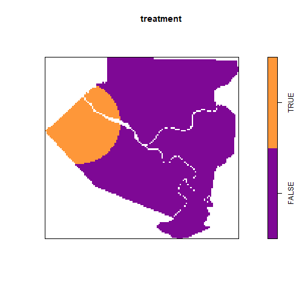

Sim 2

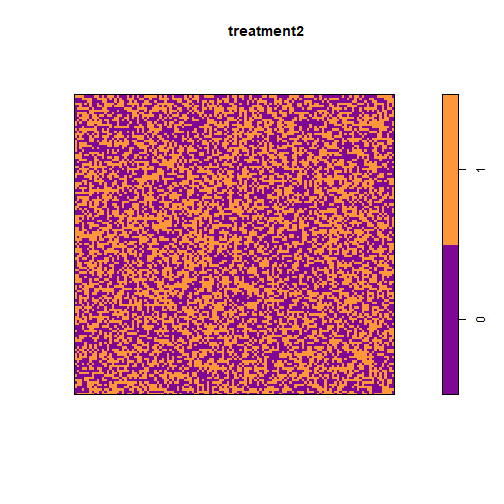

```
## Nonstationary Poisson process
## 
## Log intensity:  ~treatment2 + covar
## 
## Fitted trend coefficients:
## (Intercept)  treatment2       covar 
## -16.4888667   0.7822643   0.8043411 
## 
##                Estimate      S.E.     CI95.lo     CI95.hi Ztest        Zval
## (Intercept) -16.4888667 0.1172186 -16.7186110 -16.2591224   *** -140.667622
## treatment2    0.7822643 0.1307613   0.5259769   1.0385518   ***    5.982384
## covar         0.8043411 0.0672548   0.6725241   0.9361581   ***   11.959609
```

Sim 3

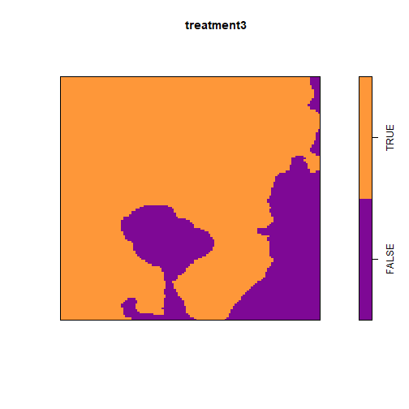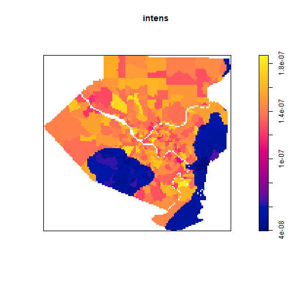

Sim 4
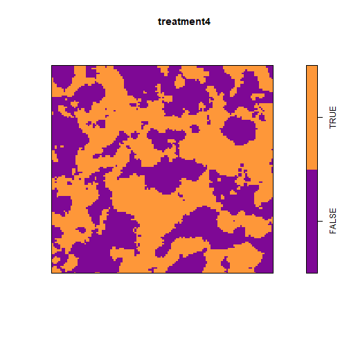

```
## Error in gam(.mpl.Y ~ treatment4 + covar + te(x, y, bs = "gp", k = 10), : could not find function "gam"
```

```
## Error in gam(.mpl.Y ~ treatment5 + covar + te(x, y, bs = "gp", k = 10), : could not find function "gam"
```
## simulation structure

Sim 5


Sim 6

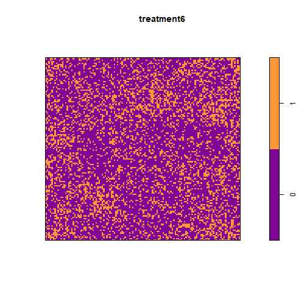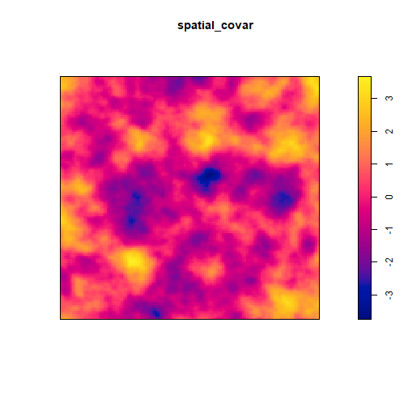

Sim 7

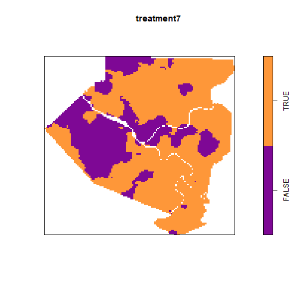

Sim 8

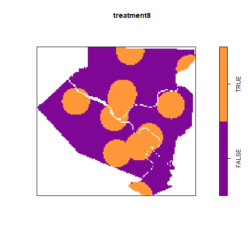
###########################
## CONTINUOUS TREATMENTS ##
###########################

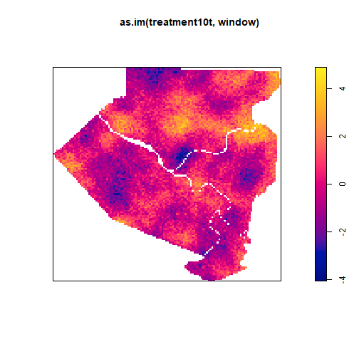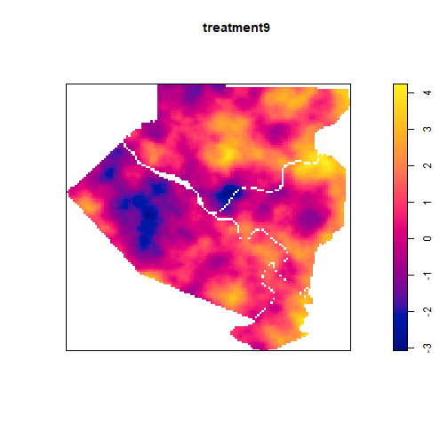

```
## Error in slice.i[inside] <- slice.inside.i: replacement has length zero
```

```
## Error in is_empty(x): object 'partials' not found
```

```
## Error in h(simpleError(msg, call)): error in evaluating the argument 'x' in selecting a method for function 'plot': object 'broken_covar' not found
```
